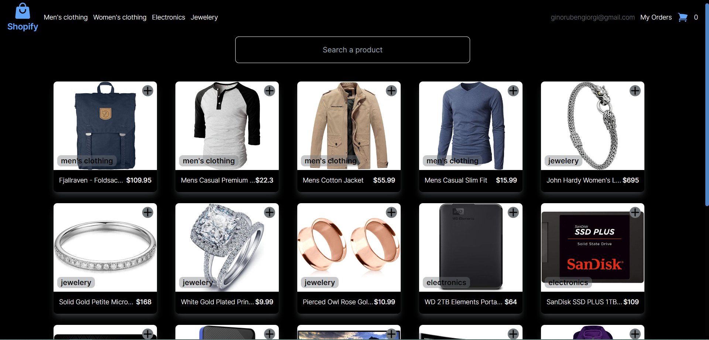
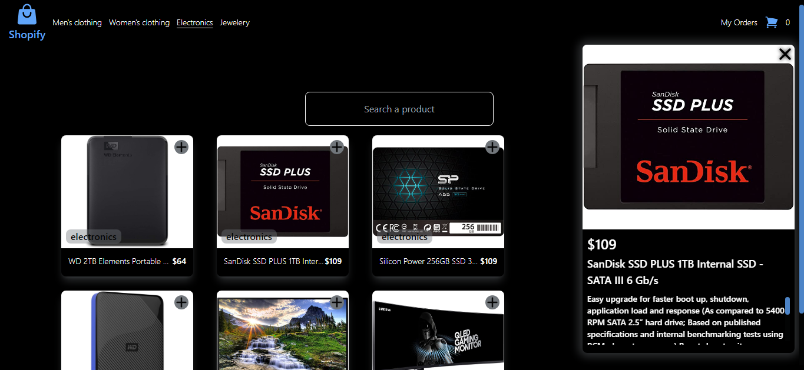
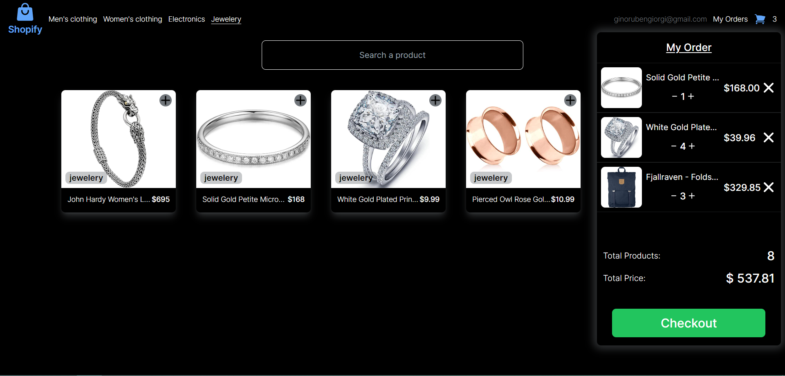
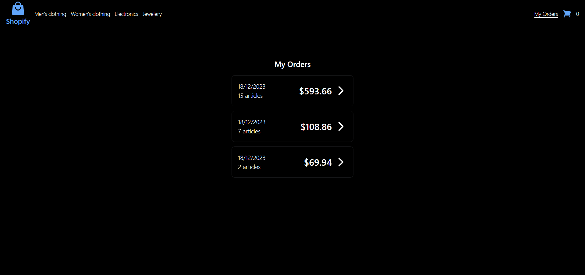
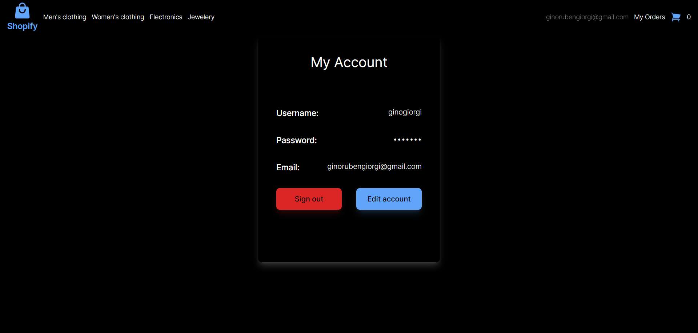

# E-Commerce App — React + Vite + Tailwind

A full-featured e-commerce web app built with React, Vite and Tailwind CSS.

🌐 **[Live demo →](https://ginogiorgi.github.io/E-Commerse-React-Vite-Tailwind/)**

## Features

- Multi-account authentication (register, login, logout)
- Shopping cart with quantity management
- Full order history per account — create, view and delete orders
- Account profile editing
- Custom API integration with category filtering
- Dark mode across all pages and components
- Smooth animations (cart, product card, auth forms)
- Fully responsive with custom scrollbars
- Form validation with error messages

## Stack

- [React 18](https://react.dev/) + [React Router 6](https://reactrouter.com/)
- [Vite](https://vitejs.dev/)
- [Tailwind CSS 3](https://tailwindcss.com/)
- [@heroicons/react](https://heroicons.com/)

## Run locally

```bash
npm install
npm run dev
```

## Screenshots

| Login | Main | Product detail |
|---|---|---|
|  |  |  |

| Cart | Orders | Account |
|---|---|---|
|  |  |  |
